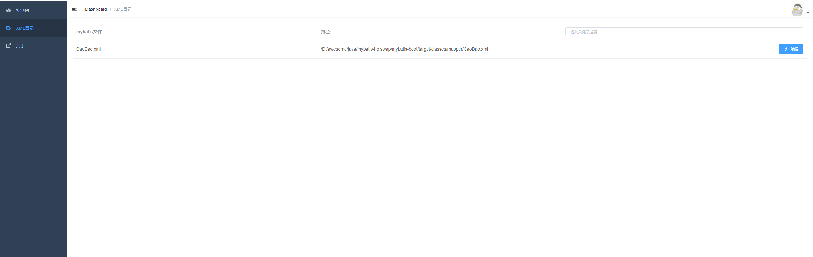
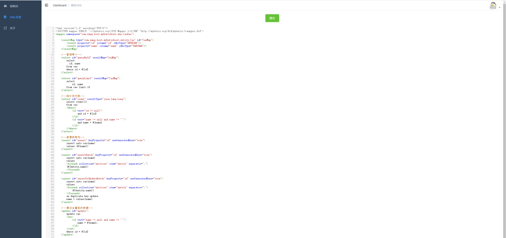

# Mybatis XML热加载

[](https://github.com/youtiaoguagua/mybatis-hotswap/actions/workflows/maven-publish.yml)


本项目为了方便在开发过程中修改mybatis xml文件，分为本地修改和线上修改两部分。

* 本地开发时只需要修改完xml文件，recompile之后插件会自动检测到文件变更，重新加载xml。

* 线上只需打开web界面即可在页面上直接编辑xml。

## 1、参考项目

  * [mybatis-mapper-reload-spring-boot-start](https://github.com/WangJi92/mybatis-mapper-reload-spring-boot-start)


## 2、使用

```yaml
mybatis:
  mapper-locations: classpath*:/mapper/*.xml
  mapper:
    reload:
      # 是否开启重载
      enable: true
      # mybatis xml文件路径
      mapper-locations: classpath*:/mapper/*.xml
      # web见面请求路径
      url-prefix: web/mybatis/reload/
      # 返回的token
      token: 123456
      # 登录用户名
      username: admin
      # 登录密码
      password: 123456
```

```xml
<dependency>
    <groupId>io.github.youtiaoguagua</groupId>
    <artifactId>mybatis-hotswap-springboot-starter</artifactId>
    <version>1.0.5-RELEASE</version>
</dependency>
```


## 3、预览

### 登录界面


### XML列表



### 编辑XML




## Licence

This project is released under the [Apache License 2.0](https://github.com/youtiaoguagua/mybatis-hotswap/blob/master/LICENSE)